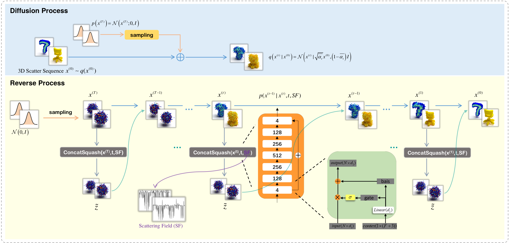

# diffusionEMIS
The official code repository for our TGRS paper "DiffusionEMIS: Diffusion Model for 3D Electromagnetic Inverse Scattering".[[Paper](https://xplorestaging.ieee.org/document/10380631)]


## Installation

**[Option 1]** Install via conda environment YAML file (**CUDA 10.1**).

```bash
# Create the environment
conda env create -f env.yml
# Activate the environment
conda activate diffuemis
```

**[Option 2]** Or you may setup the environment manually (**If you are using GPUs that only work with CUDA 11 or greater**).

Our model only depends on the following commonly used packages, all of which can be installed via conda.

| Package      | Version                          |
| ------------ | -------------------------------- |
| PyTorch      | ≥ 1.6.0                          |
| h5py         | *not specified* (we used 4.61.1) |
| tqdm         | *not specified*                  |
| tensorboard  | *not specified* (we used 2.5.0)  |
| numpy        | *not specified* (we used 1.20.2) |
| scipy        | *not specified* (we used 1.6.2)  |
| scikit-learn | *not specified* (we used 0.24.2) |

## Data Download
First, please click on the quark cloud link to download the dataset we use.[[Link](https://pan.quark.cn/s/7870a03e9c21)] .

## Training

```bash
python train.py 
```


## Testing

```bash
python test.py 
```

## Citation

```
@ARTICLE{10380631,
  author={Bi, Xueting and Chen, Yanjin and Li, Lianlin},
  journal={IEEE Transactions on Geoscience and Remote Sensing}, 
  title={DiffusionEMIS: Diffusion Model for 3-D Electromagnetic Inverse Scattering}, 
  year={2024},
  volume={62},
  number={},
  pages={1-12},
  keywords={Electromagnetic interference;Three-dimensional displays;Permittivity;Diffusion processes;Point cloud compression;Imaging;Electromagnetic scattering;3-D electromagnetic inverse scattering (EMIS);diffusion model;electrical parameter;point cloud},
  doi={10.1109/TGRS.2024.3349681}}

```
